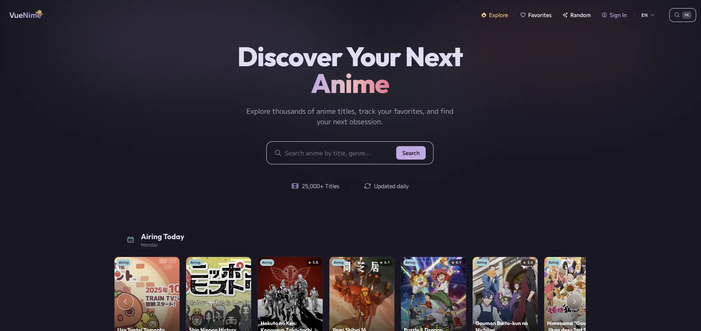

# VueNime

**Descubre tu próximo anime favorito.**

<p align="center">
  
</p>

VueNime es una plataforma moderna para descubrir anime. Explora, busca y lleva un registro de lo que te gusta. Construida con Nuxt 4 y Vue 3, obtiene datos de MyAnimeList a través de la API de Jikan y ofrece una experiencia rápida y atractiva tanto en escritorio como en móvil.

¿Lo mejor? Puedes empezar a guardar favoritos de inmediato, sin necesidad de crear una cuenta. Cuando quieras, inicia sesión con Google o GitHub para sincronizar entre todos tus dispositivos.

<p align="center">
  <a href="https://vuenime.vercel.app/">Demo en Vivo</a> •
  <a href="./docs/getting-started.md">Comenzar</a> •
  <a href="./docs/architecture.md">Arquitectura</a>
</p>

<p align="center">
  
  
  
  
</p>

---

## Documentación

| Documento                               | Descripción                                                 |
| --------------------------------------- | ----------------------------------------------------------- |
| [Comenzar](./docs/getting-started.md)   | Configurar el proyecto desde cero—Bun, variables de entorno |
| [Guía de Usuario](./docs/user-guide.md) | Cómo usar VueNime como usuario final                        |
| [Arquitectura](./docs/architecture.md)  | Decisiones técnicas, stack, convenciones de código          |

### Deep Dives de Funcionalidades

| Funcionalidad                                          | Qué Aprenderás                                             |
| ------------------------------------------------------ | ---------------------------------------------------------- |
| [Sync de Favoritos](./docs/features/favorites-sync.md) | Sincronización bidireccional entre localStorage y Supabase |
| [API Proxy](./docs/features/api-proxy.md)              | Rate limiting, deduplicación y whitelist de endpoints      |
| [Sistema de Caché](./docs/features/caching.md)         | Caché multinivel con TTL y prefetching                     |
| [Animaciones](./docs/features/animations.md)           | Efectos 3D y scroll reveal con accesibilidad               |

---

## Inicio Rápido

```bash
# Instalar Bun si no lo tienes
curl -fsSL https://bun.sh/install | bash

# Clonar y configurar
git clone https://github.com/jesus-molano/vuenime.git
cd vuenime
bun install
cp .env.example .env

# Empezar a desarrollar
bun run dev
```

Abre [http://localhost:3000](http://localhost:3000) y listo.

Para la guía completa, ve a [Comenzar](./docs/getting-started.md).

---

## Stack Tecnológico

| Capa          | Tecnología                                                                                                                                |
| ------------- | ----------------------------------------------------------------------------------------------------------------------------------------- |
| **Framework** | [Nuxt 4](https://nuxt.com/) + [Vue 3](https://vuejs.org/)                                                                                 |
| **Estilos**   | [Tailwind CSS](https://tailwindcss.com/) via [Nuxt UI](https://ui.nuxt.com/)                                                              |
| **Estado**    | [Pinia](https://pinia.vuejs.org/) con persistencia en localStorage                                                                        |
| **Backend**   | [Supabase](https://supabase.com/) (Auth + PostgreSQL)                                                                                     |
| **API**       | [Jikan](https://jikan.moe/) (API no oficial de MyAnimeList)                                                                               |
| **i18n**      | Inglés, Español, Japonés                                                                                                                  |
| **Testing**   | [Vitest](https://vitest.dev/) + [@nuxt/test-utils](https://nuxt.com/docs/getting-started/testing) + [Playwright](https://playwright.dev/) |
